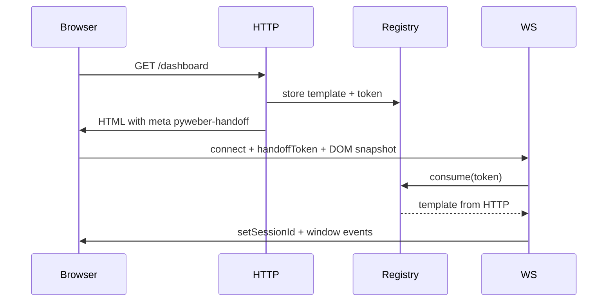

# Reactivity and UI updates

Pyweber keeps the browser in sync with your Python template tree over **WebSocket**. You change elements in Python; the client applies a **minimal diff** instead of reloading the whole page.

## The update loop

```python
async def handle_click(self, e: pw.EventHandler):
    counter = e.template.querySelector('#count')
    counter.content = str(int(counter.content) + 1)
    e.update()  # required — sends diff to the browser
```

Without `e.update()`, changes stay on the server until the next full page load.

### Other EventHandler actions

| Method | Effect |
|--------|--------|
| `e.update()` | Push DOM diff for current template |
| `e.update_all()` | Share state with other connected clients (same route) |
| `e.reload()` | Full page reload |

## Template Handoff (HTTP → WebSocket)

When a reactive HTML page is served over HTTP, Pyweber **registers the rendered template** in memory and embeds a one-time token in the page:

```html
<meta name="pyweber-handoff" content="550e8400-e29b-41d4-a716-446655440000">
```

On WebSocket connect, the browser sends that token (`handoffToken` in the payload). The server **consumes** it and attaches the stored template to the session — **without re-running your route handler**.

### Why it matters

Before 1.3.0, the first WebSocket message called `clone_template(route)`, which executed the HTTP handler again. That caused problems when handlers:

- depended on side effects that should run once (counters, DB writes),
- read `request` state from the original page load,
- were expensive or non-idempotent.

Handoff reuses exactly what HTTP already rendered.

### Flow



### Details

| Property | Behaviour |
|----------|-----------|
| Token lifetime | 5 minutes, **single use** |
| Route binding | Token only valid for the path it was created on |
| DOM sync | Client still sends current HTML on connect so form values match the browser |
| Fallback | Missing/expired token → `clone_template()` (legacy behaviour) |
| Reconnect | Existing `sessionId` → session template, handoff ignored |

!!! tip "No code changes required"
    Handoff is automatic for successful reactive HTML pages (`process_response=True`). API/JSON routes are not registered.

### DOM injectado por JavaScript (sem `uuid`)

O handoff **não substitui** o sync do DOM. No `socket.onopen` continua a enviar-se `includeTemplate: true` (HTML completo do browser). O servidor faz:

1. Consome o handoff (template Python do HTTP — evita re-correr o handler)
2. **`parse_html(outerHTML)`** — o DOM real do browser **substitui** a árvore; nós sem `uuid` recebem um novo id

Antes do envio, o cliente corre **`stampMissingUuids()`** — qualquer nó injectado por JS/libs externas ganha `uuid` **no browser e no servidor**, ficando no ciclo reactivo.

| Momento | O que acontece |
|---------|----------------|
| JS **antes** do WS abrir | Capturado no `onopen` + uuid atribuído |
| JS **depois** do WS abrir | Chamar `window.__pyweber_resyncDom()` quando o JS terminar |
| Eventos normais | Só diff (`template: null`) — não re-enviam a página inteira |

```javascript
// Exemplo: lib externa injecta HTML após load
thirdPartyWidget.render('#container').then(() => {
    window.__pyweber_resyncDom?.();
});
```

!!! warning "Limites"
    - Elementos JS **sem** `uuid` não entram em `getFormValues()` nem em eventos Pyweber até ao sync
    - Handlers Python (`_onclick`, etc.) só funcionam em elementos Pyweber ou após resync + registo no servidor
    - `clone_template()` (fallback sem handoff) segue o mesmo fluxo de `parse_html` no connect

### Disabling WebSocket

If `PYWEBER_DISABLE_WS` is set, no handoff meta is injected and the client does not connect.

## EventHandler context

```python
async def handler(self, e: pw.EventHandler):
    e.target          # element that originated the event (preferred)
    e.current_target  # element that owns the handler
    e.template        # full template instance
    e.route           # current URL path
    e.window          # browser window proxy
    e.event_data      # mouse, keyboard, touch data
    e.session         # session object for this tab
```

!!! note "`e.element` is deprecated"
    Use `e.target` instead. `e.element` remains for backward compatibility but will be removed in a future release.

## How TemplateDiff works

Internally, Pyweber compares the **new** element tree with the **previous** version:

```python
from pyweber.models.template_diff import TemplateDiff

diff = TemplateDiff()
diff.track_differences(new_element, old_element)

for uuid, change in diff.differences.items():
    print(change['status'], uuid)  # Added | Changed | Removed
```

Only changed nodes are sent to the client. This keeps interactions fast even for large pages.

### What triggers a change?

- `content`, `value`, `tag`, `id`, `classes`, `attrs`, `style`
- Event handler changes
- DOM methods queued via `focus()`, `click()`, `scroll_into_view()`, etc.
- Child list changes (via updated `content` placeholders)

## Async handlers

Event handlers may be sync or `async`. Long work should be async so the server stays responsive:

```python
async def save(self, e: pw.EventHandler):
    e.target.content = 'Saving…'
    e.update()

    await store_in_database(e.target.value)

    e.target.content = 'Saved!'
    e.update()
```

## Multiple tabs and sessions

Each browser tab gets its own **session**. Template state is isolated per session — user A’s counter does not overwrite user B’s.

Access the current session in handlers:

```python
async def handler(self, e: pw.EventHandler):
    sid = e.session.session_id
```

## Best practices

1. **One `e.update()` per logical step** — batch related changes, then update once
2. **Select elements once** — cache `querySelector` results on `self` in `__init__` when possible
3. **Clone for independent copies** — use `element.clone` before branching UI state
4. **Avoid huge full-tree rebuilds** — mutate existing elements when you can
5. **Write idempotent handlers when possible** — handoff avoids double execution on connect, but `clone_template()` fallback still exists

## Next steps

- [Events](../interaction/events.md) — event types and registration
- [Routing: multiple methods](routing-advanced.md#multiple-http-methods-on-one-path) — GET/POST/DELETE on one path
- [Element model](element-model.md) — child order and placeholders
