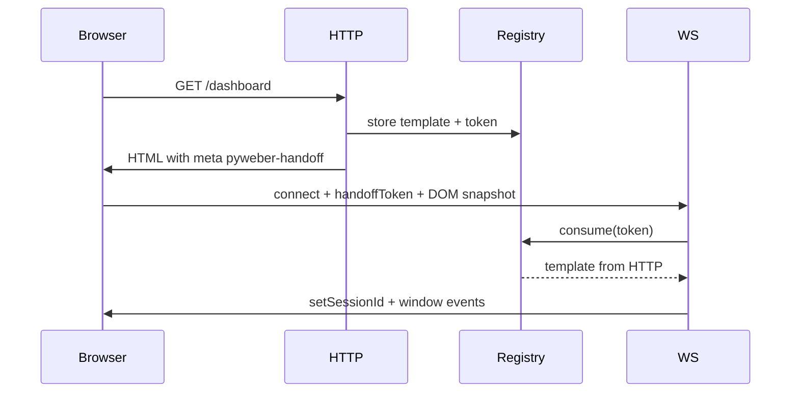

# Reactivity and UI updates

Pyweber keeps the browser in sync with your Python template tree over **WebSocket**. You change elements in Python; the client applies a **minimal diff** instead of reloading the whole page.

## The update loop

```python
async def handle_click(self, e: pw.EventHandler):
    counter = e.template.querySelector('#count')
    counter.content = str(int(counter.content) + 1)
    e.update()  # required — sends diff to the browser
```

Without `e.update()`, changes stay on the server until the next full page load.

!!! tip "Fixed in 1.6.0.dev3"
    Click payloads often send `template: null` with a `values` map (input text by uuid). The server always applies those values before your handler runs, so `input.value` / `e.current_target.parent.childs[0].value` reflect what the user typed. WS session bind and Form/Input clone regressions that dropped events or resent `setSessionId` every frame are also fixed — see [CHANGELOG](../changelog.md).

### Other EventHandler actions

| Method | Effect |
|--------|--------|
| `e.update()` | Push DOM diff for current template |
| `e.update_all()` | Share state with other connected clients (same route) |
| `e.reload()` | Full page reload |

## Template Handoff (HTTP → WebSocket)

!!! tip "Added in 1.3.0"
    WebSocket sessions reuse the HTTP-rendered template so route handlers are not run twice on connect.

!!! tip "Improved in 1.6.0"
    Handoff **moves** the same Python instance into the session; DOM sync **merges by uuid** so `self` / subclass refs stay valid after connect.

When a reactive HTML page is served over HTTP, Pyweber **registers the rendered template** in memory and embeds a one-time token in the page:

```html
<meta name="pyweber-handoff" content="550e8400-e29b-41d4-a716-446655440000">
```

On WebSocket connect, the browser sends that token (`handoffToken` in the payload). The server **consumes** it and attaches the stored template to the session — **without re-running your route handler**.

### Why it matters

Before 1.3.0, the first WebSocket message called `clone_template(route)`, which executed the HTTP handler again. That caused problems when handlers:

- depended on side effects that should run once (counters, DB writes),
- read `request` state from the original page load,
- were expensive or non-idempotent.

Handoff reuses exactly what HTTP already rendered.

### Flow


```mermaid
sequenceDiagram
    participant Browser
    participant HTTP
    participant Registry
    participant WS

    Browser->>HTTP: GET /dashboard
    HTTP->>Registry: store template + token
    HTTP->>Browser: HTML with meta pyweber-handoff
    Browser->>WS: connect + handoffToken + DOM snapshot
    WS->>Registry: consume(token)
    Registry-->>WS: template from HTTP
    WS->>Browser: setSessionId + window events
```

### Details

| Property | Behaviour |
|----------|-----------|
| Token lifetime | 5 minutes, **single use** |
| Route binding | Token only valid for the path it was created on |
| DOM sync | Client still sends current HTML on connect so form values match the browser |
| Fallback | Missing/expired token → `clone_template()` (legacy behaviour) |
| Reconnect | Existing `sessionId` → session template, handoff ignored |

!!! tip "No code changes required"
    Handoff is automatic for successful reactive HTML pages (`process_response=True`). API/JSON routes are not registered.

### DOM injectado por JavaScript (sem `uuid`)

Nos cliques normais o cliente **não** reenvia a página (`template: null`) — só `values` + evento. Isso é correcto para performance, mas nós criados só no browser ficam invisíveis à sessão Python até haver um **merge**.

O handoff / `onopen` já envia `includeTemplate: true`. O servidor faz:

1. Consome o handoff — **a mesma** instância `Template` / árvore Python do HTTP
2. **`merge_client_dom`** — actualiza nós existentes por `uuid` e **enxerta** nós só-do-cliente

Antes do envio, o cliente corre **`stampMissingUuids()`** — nós injectados ganham `uuid` e entram no ciclo reactivo.

| Momento | O que acontece |
|---------|----------------|
| JS **antes** do WS abrir | Capturado no `onopen` → graft no merge |
| JS **depois** do WS abrir | **Auto:** `MutationObserver` (debounce ~80ms) detecta nós sem `uuid` e chama resync |
| Controlo explícito | `window.__pyweber_adopt(el)` ou `window.__pyweber_resyncDom()` |
| Eventos normais | Só diff (`template: null`) — não re-enviam a página |

```javascript
// Explícito (recomendado após widgets grandes)
thirdPartyWidget.render('#container').then(() => {
    window.__pyweber_resyncDom?.();
});

// Ou um único nó
const tip = document.createElement('div');
tip.textContent = 'hint';
document.body.appendChild(tip);
await window.__pyweber_adopt?.(tip);
```

Desligar o observer automático (páginas com muito DOM dinâmico irrelevante para Python):

```html
<meta name="pyweber-dom-watch" content="off">
```

!!! tip "Added in 1.6.0.dev3"
    `MutationObserver` + `__pyweber_adopt` — injects JS-side leave the server tree without waiting for the next full reload.

!!! warning "Limites"
    - Elementos **sem** `uuid` não entram em `getFormValues()` / eventos Pyweber até ao sync
    - Handlers Python (`_onclick`) só em elementos criados no servidor (ou após merge; o graft não regista callables Python automaticamente)
    - `include_uuid=False` ignora outerHTML do cliente (páginas estáticas)
    - O observer não substitui `e.update()` — só alinha DOM browser → sessão

### Using `self` in event handlers

!!! tip "Added in 1.6.0"
    Identity-preserving sync — `self.label` and other `__init__` refs remain the live tree after WS connect.

After connect, the session still holds the objects you built:

```python
class Counter(pw.Element):
    def __init__(self):
        self.label = pw.Element('span', id='n', content='0')
        super().__init__('div', childs=[
            self.label,
            pw.Element('button', content='+', events=pw.TemplateEvents(onclick=self.inc)),
        ])

    async def inc(self, e: pw.EventHandler):
        self.label.content = str(int(self.label.content) + 1)  # OK — same instance
        e.update()
```

You can still use `e.template.querySelector(...)` when convenient; it is no longer required to work around a rebuilt tree.

### Disabling WebSocket

If `PYWEBER_DISABLE_WS` is set, no handoff meta is injected and the client does not connect.

## EventHandler context

```python
async def handler(self, e: pw.EventHandler):
    e.target          # element that originated the event (preferred)
    e.current_target  # element that owns the handler
    e.template        # full template instance
    e.route           # current URL path
    e.window          # browser window proxy
    e.event_data      # mouse, keyboard, touch data
    e.session         # session object for this tab
```

!!! warning "Deprecated — removed in 2.0"
    Use `e.target` instead of `e.element`. Prefer `e.target` in all new code. See [Deprecations](deprecations.md).

## How TemplateDiff works

Internally, Pyweber compares the **new** element tree with the **previous** version:

```python
from pyweber.models.template_diff import TemplateDiff

diff = TemplateDiff()
diff.track_differences(new_element, old_element)

for uuid, change in diff.differences.items():
    print(change['status'], uuid)  # Added | Changed | Removed
```

Only changed nodes are sent to the client. This keeps interactions fast even for large pages.

### What triggers a change?

- `content`, `value`, `tag`, `id`, `classes`, `attrs`, `style`
- Event handler changes
- DOM methods queued via `focus()`, `click()`, `scroll_into_view()`, etc.
- Child list changes (via updated `content` placeholders)

## Async handlers

Event handlers may be sync or `async`. Long work should be async so the server stays responsive:

```python
async def save(self, e: pw.EventHandler):
    e.target.content = 'Saving…'
    e.update()

    await store_in_database(e.target.value)

    e.target.content = 'Saved!'
    e.update()
```

## Multiple tabs and sessions

Each browser tab gets its own **session**. Template state is isolated per session — user A’s counter does not overwrite user B’s.

Access the current session in handlers:

```python
async def handler(self, e: pw.EventHandler):
    sid = e.session.session_id
```

## Best practices

1. **One `e.update()` per logical step** — batch related changes, then update once
2. **Select elements once** — cache `querySelector` results on `self` in `__init__` when possible
3. **Clone for independent copies** — use `element.clone` before branching UI state
4. **Avoid huge full-tree rebuilds** — mutate existing elements when you can
5. **Write idempotent handlers when possible** — handoff avoids double execution on connect, but `clone_template()` fallback still exists

## Next steps

- [Events](../interaction/events.md) — event types and registration
- [Routing: multiple methods](routing-advanced.md#multiple-http-methods-on-one-path) — GET/POST/DELETE on one path
- [Element model](element-model.md) — child order and placeholders
